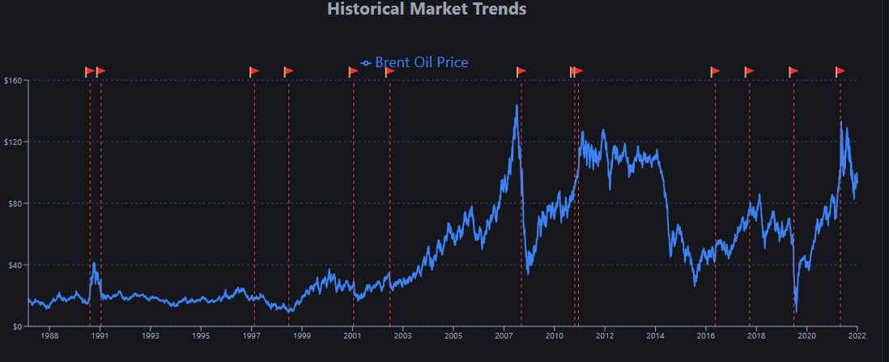
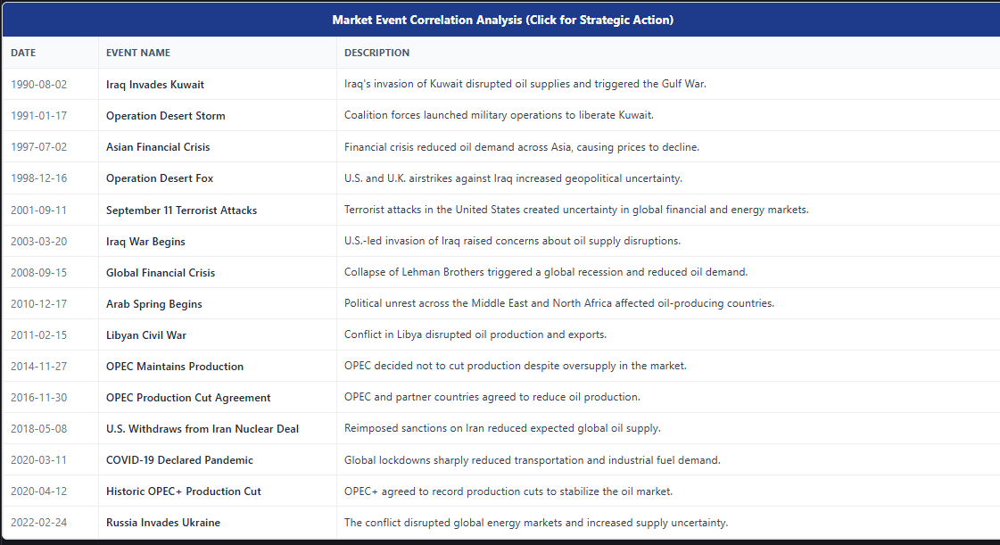

# Brent Oil Price Change Point Analysis Dashboard

## Project Overview

This project analyzes historical Brent crude oil prices to identify structural breaks using Bayesian Change Point Detection and visualizes the results through an interactive Flask and React dashboard.

The project combines:

- Exploratory Data Analysis (EDA)
- Bayesian Change Point Detection (PyMC)
- Event Analysis
- Flask REST API
- React Dashboard
- Interactive Charts

---

# Project Structure

```
brent-oil-change-point-analysis/

│
├── backend/
│   ├── api/
│   ├── services/
│   ├── tests/
│   ├── app.py
│   └── config.py
│
├── frontend/
│   ├── src/
│   ├── public/
│   ├── package.json
│   └── vite.config.js
│
├── notebooks/
│   ├── Task1_EDA.ipynb
│   ├── Task2_ChangePoint.ipynb
│   └── Task3_Dashboard.ipynb
│
├── src/
├── tests/
├── requirements.txt
└── README.md
```

---

# Technologies

## Backend

- Python
- Flask
- Flask-CORS
- Pandas
- NumPy
- PyMC
- ArviZ

## Frontend

- React
- Vite
- Axios
- Bootstrap
- Recharts

## Testing

- pytest

---

# Dataset

The project uses:

- BrentOilPrices.csv
- events.csv

---

# Task 1

Performed Exploratory Data Analysis including:

- Data loading
- Data cleaning
- Summary statistics
- Missing value analysis
- Time-series visualization
- Rolling averages
- Log return calculation

---

# Task 2

Implemented Bayesian Change Point Detection using PyMC.

Workflow:

- Monthly aggregation
- Log return computation
- Bayesian model
- Posterior inference
- Change point identification
- Impact quantification

Example result:

- Change Point:
  - 2004-02-29

Average price before change:

- \$20.20

Average price after change:

- \$73.73

Estimated increase:

- 265.06%

---

# Task 3

Developed an interactive dashboard.

Features include:

- Historical Price Chart
- KPI Cards
- Rolling Volatility
- Event Table
- Date Filters
- Search
- Responsive Design

---

# Backend Setup

Create virtual environment

```
python -m venv .venv
```

Activate

Windows

```
.venv\Scripts\activate
```

Install dependencies

```
pip install -r requirements.txt
```

Run Flask

```
python app.py
```

Server starts at

```
http://127.0.0.1:5000
```

---

# Frontend Setup

Move to frontend

```
cd frontend
```

Install packages

```
npm install
```

Run React

```
npm run dev
```

Application starts at

```
http://localhost:5173
```

---

# API Endpoints

| Endpoint | Description |
|----------|-------------|
| /api/health | Health Check |
| /api/prices | Historical Brent Prices |
| /api/events | Historical Events |
| /api/statistics | Dashboard KPI Statistics |
| /api/volatility | Rolling Volatility |
| /api/change-point | Bayesian Change Point Results |

---

# Dashboard Features

- Historical Brent Price Visualization
- Bayesian Change Point Marker
- Rolling Volatility
- Event Timeline
- KPI Cards
- Event Search
- Responsive Bootstrap Layout

---

# Testing

Backend

```
pytest
```

---

## Dashboard Screenshots

### Dashboard Home


---

### Volatility Chart



---

### Event Table



